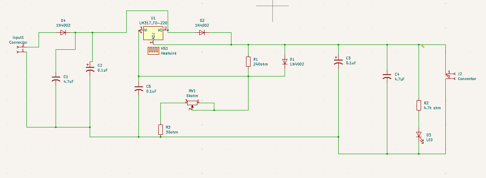
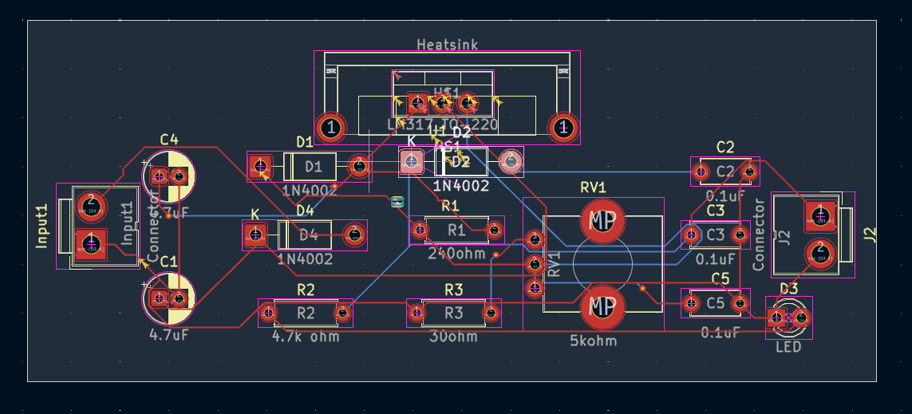

HEY There!
I Built this custom voltage regulator that uses LM317 Regulator to maintain a constant Desired voltage for the load
Here is the schematics of the whole circuit

Here the R1 = 240 ohms that is fixed the potentiometer resistance can be varied nd if you are interested in finding out the exact math do check out the official datasheet

here is the pcb img

As you can see kicad is throwing DRC ERRORS but I think I have placed the heat sink in the right place if it isn't please lemme know :)
